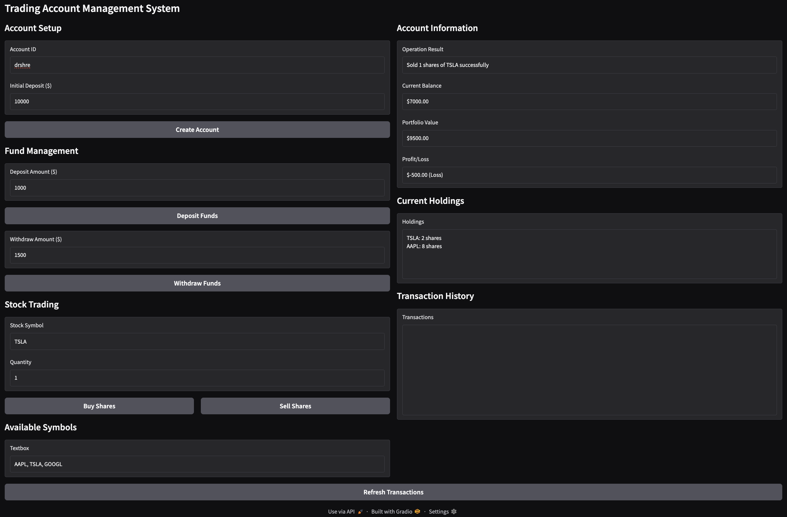

# EngineeringTeam Crew

This is an EngineeringTeam Crew project, powered by [crewAI](https://crewai.com). Here I setup a multi-agent AI system, leveraging the powerful and flexible framework provided by crewAI. The goal is to enable the agents representing the team to collaborate effectively on complex tasks, maximizing their collective intelligence and capabilities.

## There are four agents:
 ### 1) Engineering Lead
Responsible for turning the high-level project requirements into a clear, detailed technical design. They define the Python module structure, class name, and method signatures so the backend engineer has an unambiguous blueprint to implement.

 ### 2) Backend Engineer
Implements the module exactly according to the engineering lead’s design. Their job is to write clean, self-contained Python code that fulfills all requirements and is ready for testing or UI integration.

 ### 3) Frontend Engineer
Creates a simple Gradio UI that demonstrates how the backend module works. They write an app.py in the same directory, enabling users to interact with the functionality visually.

 ### 4) Test Engineer
Writes unit tests for the backend module to ensure correctness and reliability. They create a test_{module_name}.py file that verifies the backend behaves as expected.

## The final output looks as follows in gradio:
