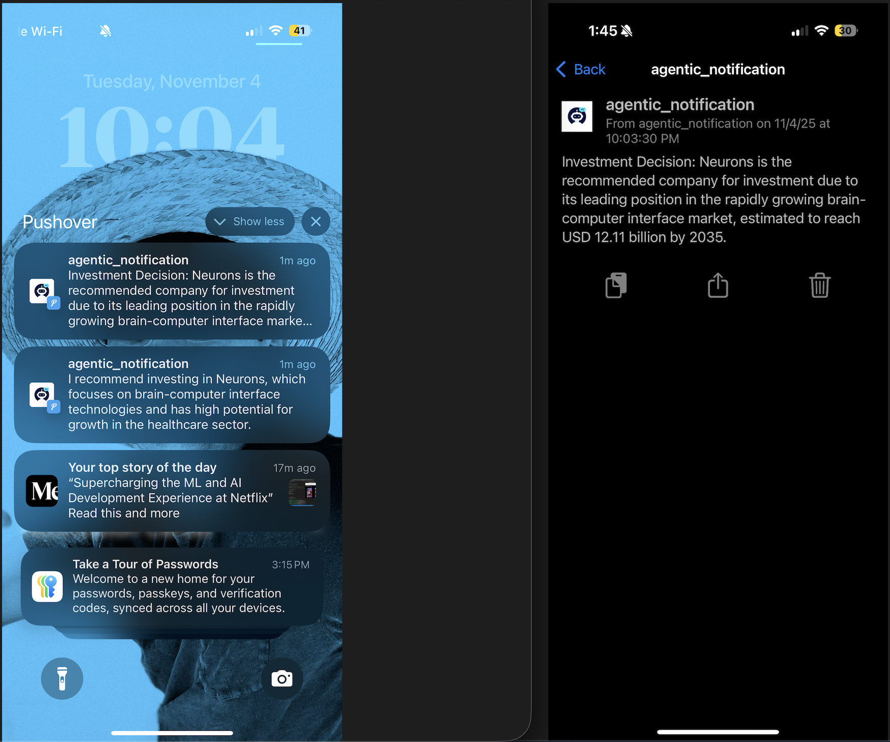

# EngineeringTeam Crew

This is an agentic Crew project, powered by [crewAI](https://crewai.com). This project automates the process of finding and evaluating investment opportunities. One agent identifies trending companies, another researches them, a third selects the best investment choice, and a manager agent coordinates the workflow to produce a final recommendation.

## There are four agents:

* **trending_company_finder**: Scans recent financial news in a given sector and identifies 2–3 companies currently trending, ensuring new companies are selected each time.

* **financial_researcher**: Takes the list of trending companies and produces a thorough, detailed analysis of each, evaluating their business and market positioning.

* **stock_picker**: Reviews the research and chooses the single best investment candidate, providing a clear explanation and avoiding previously selected companies.

* **manager**: Oversees the workflow, delegating tasks among the other agents to ensure the final result is a well-reasoned investment recommendation.

## The final outpout looks as follows in gradio:
